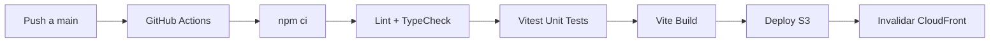
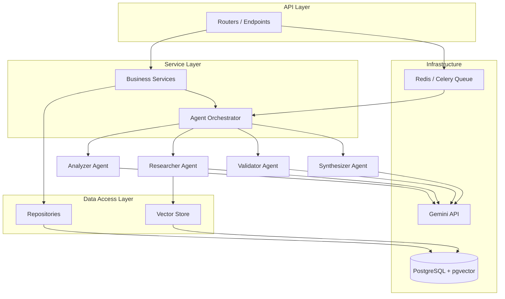
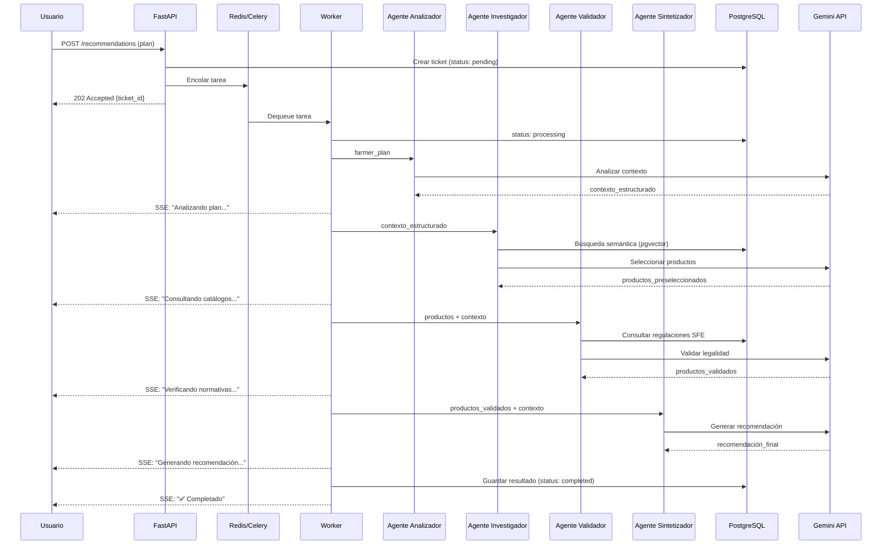

# SynapSeed — Plan de Implementación Integral (Caso 2)

Plan maestro que cubre las 5 etapas de la asignación: prototipado UX, diseño de frontend, diseño de backend + datos, MVP y demo.

## Decisions Resolved ✅

- **TailwindCSS:** v4 (CSS-first, sin `tailwind.config.js`)
- **Cola de tareas MVP:** Celery + Redis
- **Orquestación IA:** LangGraph 1.2 + LangChain 1.x
- **Propósito:** Solo información y recomendaciones. **Nada de compras ni pagos.**
- **Identidad visual:** Paleta verde (a definir sistema de diseño completo)
- **Datos semilla:** Productos reales del SFE disponibles públicamente
- **Regulaciones SFE/MAG:** Accesibles públicamente, se investigarán
- **Formularios:** Todos los campos del wizard usan **dropdowns (Select)**, no text inputs


---

## Proposed Changes

La estructura final del repositorio será:

```
SynapSeed/
├── src/
│   ├── frontend/            # React + Vite + TypeScript
│   └── backend/             # FastAPI + Python
├── Docs/                    # Documentación del proyecto
│   ├── Caso2_asignacion_entrega.md
│   ├── Spec_validada.md
│   ├── AgentOrchs.md
│   └── database/            # DBML, ERD
├── .github/
│   └── workflows/           # CI/CD pipelines
├── docker-compose.yml       # Desarrollo local
├── README.md                # Documentación central
└── .gitignore
```

---

### Etapa 1 — Prototipado y Refinamiento UX (5%)

> [!NOTE]
> Esta etapa requiere trabajo manual del equipo (UX Testing con 4 estudiantes). Aquí se documenta qué debe producirse.

#### Entregables esperados

| Entregable | Formato | Ubicación |
|---|---|---|
| Prototipo interactivo de la ventana principal | Figma / Maze | Link en `Docs/ux/` |
| Tareas definidas para UX Testing | Markdown | `Docs/ux/testing_tasks.md` |
| Resultados del UX Testing (4 participantes) | Markdown + capturas | `Docs/ux/testing_results.md` |
| Problemas detectados y correcciones aplicadas | Markdown | `Docs/ux/corrections.md` |
| Métricas básicas de usabilidad | Tabla | Incluido en `testing_results.md` |

#### Flujo principal a prototipar

El flujo de recomendación de agroquímicos es el flujo principal:
1. **Login** con cédula + contraseña (o registro con email, nombre, cédula, teléfono, contraseña)
2. **Gestión del caso (wizard):** Seleccionar zona → contexto ambiental (si no hay zona) → datos del problema (todo con dropdowns) → pantalla de confirmación
3. **Estado de procesamiento:** Pantalla con progreso en tiempo real (SSE) mostrando cada agente
4. **Resultado:** 3 productos recomendados + tabla comparativa + botón "Ver proveedores"
5. **Proveedores:** Lista con nombre, correo, teléfono, ubicación + botón "Contactar" (mailto:)

---

### Etapa 2 — Diseño del Frontend (10%)

#### [NEW] `frontend/` — Proyecto React + Vite + TypeScript

##### Tech Stack y Versiones

| Tecnología | Versión | Justificación |
|---|---|---|
| React | 19.x | Última estable, soporte completo de hooks y Suspense |
| TypeScript | 5.8.x | Tipado estático, mejor DX y mantenibilidad |
| Vite | 6.x | Build tool ultra-rápido, HMR instantáneo, mejor que CRA/Webpack |
| Zustand | 5.x | Estado cliente ligero (~1KB), API simple, sin boilerplate |
| TanStack Query | 5.x | Cache de servidor, refetch automático, mutations optimistas |
| TailwindCSS | 4.x | CSS-first config, modern, tree-shaking nativo |
| shadcn/ui | Latest | Componentes copiados al proyecto, control total, basados en Radix |
| React Router | 7.x | Routing declarativo con data loaders |

##### Estructura de carpetas

```
frontend/
├── public/
├── src/
│   ├── app/                        # Setup global
│   │   ├── App.tsx                 # Root con providers
│   │   ├── main.tsx                # Entry point
│   │   ├── router.tsx              # Definición de rutas
│   │   └── providers.tsx           # QueryClient, theme, auth
│   │
│   ├── components/                 # Componentes compartidos
│   │   └── ui/                     # shadcn/ui (generados por CLI)
│   │       ├── button.tsx
│   │       ├── card.tsx
│   │       ├── select.tsx          # Dropdown (usado en todo el wizard)
│   │       └── ...
│   │
│   ├── features/                   # Módulos por dominio
│   │   ├── auth/
│   │   │   ├── components/         # LoginForm (cédula+password), RegisterForm
│   │   │   ├── hooks/
│   │   │   ├── services/
│   │   │   └── types/
│   │   │
│   │   ├── recommendations/
│   │   │   ├── components/         # ContextWizard, ConfirmationStep,
│   │   │   │                       # ProgressTracker, ResultView (3 cards),
│   │   │   │                       # ComparisonTable, ProvidersView
│   │   │   ├── hooks/              # useCreateRecommendation, useSSEStream
│   │   │   ├── services/
│   │   │   └── types/
│   │   │
│   │   ├── zones/
│   │   │   ├── components/         # ZoneList, ZoneForm (modal), ZoneCard
│   │   │   ├── hooks/
│   │   │   └── services/
│   │   │
│   │   ├── history/
│   │   │   ├── components/         # HistoryList, HistoryDetail
│   │   │   └── hooks/
│   │   │
│   │   └── account/
│   │       ├── components/         # ProfileForm, PasswordForm
│   │       └── hooks/
│   │
│   ├── hooks/                      # Hooks globales compartidos
│   │   ├── useSSE.ts               # Hook genérico SSE
│   │   └── useDebounce.ts
│   │
│   ├── lib/                        # Utilidades
│   │   ├── api.ts                  # Axios instance + interceptors
│   │   ├── utils.ts                # Helpers generales
│   │   └── cn.ts                   # clsx + tailwind-merge
│   │
│   ├── stores/                     # Zustand (estado cliente)
│   │   ├── authStore.ts            # Token, user, sesión
│   │   ├── uiStore.ts              # Sidebar, theme
│   │   └── wizardStore.ts          # Estado del wizard de contexto
│   │
│   ├── types/                      # Tipos globales
│   │   ├── api.ts                  # Tipos de respuesta API
│   │   └── models.ts               # Modelos de dominio
│   │
│   └── styles/
│       └── globals.css             # TailwindCSS v4 imports + tokens
│
├── index.html
├── vite.config.ts
├── tsconfig.json
├── vitest.config.ts
├── components.json                 # shadcn/ui config
├── package.json
└── playwright.config.ts
```

##### Patrones arquitectónicos del frontend

**1. Separación de estado cliente/servidor:**
- **Zustand** → estado de UI, auth tokens, preferencias (client state)
- **TanStack Query** → datos del API, cache, refetch, mutations (server state)
- Regla: **nunca** duplicar datos del API en Zustand

**2. Feature-based modules:**
- Cada feature es auto-contenida (components, hooks, services, types)
- Comunicación entre features solo via stores globales o React Query cache

**3. Compound Components:**
- shadcn/ui ya sigue este patrón (Dialog.Trigger, Dialog.Content, etc.)
- Componentes complejos propios seguirán el mismo patrón

##### Sistema de diseño y tokens CSS

```css
/* globals.css — TailwindCSS v4 */
@import "tailwindcss";

@theme {
  /* Colores primarios — Verdes agrícolas */
  --color-primary-50: #f0fdf4;
  --color-primary-100: #dcfce7;
  --color-primary-500: #22c55e;
  --color-primary-600: #16a34a;
  --color-primary-700: #15803d;
  --color-primary-900: #14532d;

  /* Colores secundarios — Tierra/marrón */
  --color-secondary-50: #fefce8;
  --color-secondary-500: #eab308;
  --color-secondary-700: #a16207;

  /* Colores de estado */
  --color-success: #22c55e;
  --color-warning: #f59e0b;
  --color-error: #ef4444;
  --color-info: #3b82f6;

  /* Tipografía */
  --font-sans: 'Inter', system-ui, sans-serif;
  --font-mono: 'JetBrains Mono', monospace;

  /* Espaciado base */
  --spacing-xs: 0.25rem;
  --spacing-sm: 0.5rem;
  --spacing-md: 1rem;
  --spacing-lg: 1.5rem;
  --spacing-xl: 2rem;

  /* Border radius */
  --radius-sm: 0.375rem;
  --radius-md: 0.5rem;
  --radius-lg: 0.75rem;
  --radius-xl: 1rem;
}
```

##### Seguridad del frontend

| Aspecto | Implementación |
|---|---|
| **Autenticación** | Login con **cédula + contraseña**. JWT access token en Zustand (memoria) |
| **Registro** | email, nombre completo, cédula, teléfono, contraseña |
| **Autorización** | Route guards para páginas protegidas |
| **Token expiry** | JWT 24h, auto-redirect a login si expira |
| **Sesiones** | Zustand persist (localStorage) para datos no sensibles; tokens en memoria |
| **OWASP** | CSP headers, XSS sanitization |
| **Input validation** | Zod schemas para validación client-side (todos dropdowns, sin texto libre) |
| **Data masking** | Datos sensibles (cédula, teléfono) enmascarados en UI por defecto |

##### SSE (Server-Sent Events) — Consumo en React

```typescript
// hooks/useSSE.ts
export function useRecommendationSSE(ticketId: string | null) {
  const queryClient = useQueryClient()

  useEffect(() => {
    if (!ticketId) return
    const es = new EventSource(`${API_URL}/recommendations/${ticketId}/events`)

    es.addEventListener('status_update', (e) => {
      const data = JSON.parse(e.data)
      queryClient.setQueryData(['recommendation', ticketId], (old) => ({
        ...old, status: data.status, message: data.message
      }))
    })

    es.addEventListener('completed', (e) => {
      const data = JSON.parse(e.data)
      queryClient.setQueryData(['recommendation', ticketId], data.result)
      queryClient.invalidateQueries({ queryKey: ['recommendations'] })
      es.close()
    })

    es.onerror = () => { es.close() /* fallback to polling */ }
    return () => es.close()
  }, [ticketId])
}
```

##### Estrategia de testing del frontend

| Tipo | Herramienta | Cobertura mínima | Enfoque |
|---|---|---|---|
| **Unit** | Vitest + React Testing Library | 70% | Hooks, stores, utilidades, lógica |
| **Component** | Vitest + RTL | 70% | Componentes interactivos, formularios |
| **E2E** | Playwright | Flujos críticos | Login, crear recomendación, ver resultado |
| **Visual** | Playwright screenshots | Páginas clave | Regresión visual |

##### Performance y optimización

- **Code splitting:** `React.lazy()` + `Suspense` por ruta
- **Manual chunks:** vendor, query, ui separados en `vite.config.ts`
- **Images:** WebP/AVIF, `loading="lazy"`, optimización via Vite plugin
- **Lists:** `@tanstack/react-virtual` para catálogos de productos largos
- **Cache:** `staleTime: 5min` en React Query para datos que cambian poco
- **Memoization:** `React.memo` en componentes de lista, `useMemo` para cómputos

##### CI/CD del frontend



Pipeline: lint → typecheck → test → build → sync S3 → invalidate CloudFront cache.

---

### Etapa 3 — Diseño del Backend y Data (20%)

#### [NEW] `backend/` — FastAPI + Python

##### Tech Stack y Versiones

| Tecnología | Versión | Justificación |
|---|---|---|
| Python | 3.12+ | Performance mejorado, better typing, task groups |
| FastAPI | 0.115.x | Framework async moderno, auto-docs OpenAPI, Pydantic nativo |
| SQLAlchemy | 2.0.x | ORM async con asyncpg, type hints, expression language |
| Alembic | 1.14.x | Migraciones versionadas, auto-generate desde modelos |
| Pydantic | 2.10.x | Validación rápida (Rust core), DTOs, settings |
| LangChain | 1.x | Framework base para agentes e integración con LLMs |
| LangGraph | 1.2.x | Orquestación de agentes multi-step con estado (reemplaza SequentialChain) |
| pgvector | 0.8.x | Búsqueda semántica vectorial en PostgreSQL |
| Celery | 5.4.x | Cola de tareas distribuida para procesamiento async |
| Redis | 7.x | Broker para Celery + cache + SSE pub/sub |
| asyncpg | 0.30.x | Driver PostgreSQL async de alto rendimiento |
| pytest | 8.x | Testing framework |

##### Arquitectura en capas



| Capa | Responsabilidad | Restricciones |
|---|---|---|
| **API (Routers)** | Recibir HTTP, validar input, devolver response | Sin lógica de negocio, sin acceso directo a DB |
| **Services** | Lógica de negocio, coordinación entre repos | Sin conocimiento de HTTP, sin queries directas |
| **Repositories** | Acceso a datos, queries SQL/ORM | Sin lógica de negocio, retorna modelos |
| **Agents** | Orquestación IA, prompts, tools | Aislados, testables con mocks |
| **Workers** | Procesamiento en background | Consume cola, ejecuta pipeline de agentes |

##### Estructura de carpetas del backend

```
backend/
├── app/
│   ├── __init__.py
│   ├── main.py                     # App factory, startup/shutdown
│   ├── config.py                   # pydantic-settings
│   ├── dependencies.py             # DI (get_db, get_current_user)
│   │
│   ├── api/v1/                     # Routers
│   │   ├── router.py               # Agrega todos los sub-routers
│   │   ├── auth.py                 # POST /login (cédula+password), /register
│   │   ├── users.py                # GET /me, PUT /me, PUT /me/password
│   │   ├── zones.py                # CRUD zonas/fincas del usuario
│   │   ├── recommendations.py      # POST /request, GET /{id}, GET /history, GET /stream/{ticket_id} (SSE)
│   │   ├── providers.py            # GET /recommendations/{id}/providers
│   │   └── catalogs.py             # GET /crops, /crop-stages, /soil-types, /problems, etc (dropdowns)
│   │
│   ├── core/                       # Cross-cutting
│   │   ├── security.py             # JWT, hashing, OAuth2
│   │   ├── exceptions.py           # Custom exceptions + handlers
│   │   ├── middleware.py           # CORS, logging, rate limiting
│   │   └── events.py              # SSE helpers
│   │
│   ├── models/                     # SQLAlchemy ORM
│   │   ├── base.py                 # DeclarativeBase
│   │   ├── user.py                 # + identification, phone
│   │   ├── zone.py                 # Zonas/fincas del usuario
│   │   ├── recommendation.py       # + recommendation_products
│   │   ├── product.py
│   │   ├── distributor.py          # + location
│   │   ├── regulation.py
│   │   └── audit.py
│   │
│   ├── schemas/                    # Pydantic DTOs
│   │   ├── user.py                 # UserCreate (email,name,identification,phone,password), UserResponse
│   │   ├── zone.py                 # ZoneCreate, ZoneResponse
│   │   ├── recommendation.py       # CaseContext (todos dropdowns), RecommendationResult
│   │   ├── product.py
│   │   ├── provider.py             # ProviderResponse (name, email, phone, location)
│   │   └── common.py              # Pagination, ErrorResponse
│   │
│   ├── services/                   # Lógica de negocio
│   │   ├── auth_service.py         # Login con cédula, registro
│   │   ├── zone_service.py         # CRUD zonas
│   │   ├── recommendation_service.py
│   │   ├── provider_service.py     # Buscar proveedores por recomendación
│   │   └── notification_service.py # SSE
│   │
│   ├── repositories/              # Acceso a datos
│   │   ├── base.py                # GenericRepository[T]
│   │   ├── user_repo.py           # get_by_identification
│   │   ├── zone_repo.py           # get_by_user_id
│   │   ├── recommendation_repo.py
│   │   └── product_repo.py        # Incluye semantic_search()
│   │
│   ├── agents/                    # Orquestación IA
│   │   ├── orchestrator.py        # Pipeline secuencial
│   │   ├── analyzer_agent.py      # Agente Analizador de Contexto
│   │   ├── researcher_agent.py    # Agente Investigador (RAG)
│   │   ├── validator_agent.py     # Agente Validador Legal
│   │   ├── synthesizer_agent.py   # Agente Sintetizador
│   │   ├── prompts/               # Templates de prompts
│   │   │   ├── analyzer.py
│   │   │   ├── researcher.py
│   │   │   ├── validator.py
│   │   │   └── synthesizer.py
│   │   └── tools/                 # Herramientas de los agentes
│   │       ├── vector_search.py   # Búsqueda semántica
│   │       ├── product_lookup.py  # Consulta de productos
│   │       └── regulation_check.py # Verificación normativa
│   │
│   ├── workers/                   # Background processing
│   │   ├── celery_app.py          # Configuración Celery
│   │   └── recommendation_worker.py
│   │
│   └── db/                        # Database
│       ├── session.py             # Async engine + session factory
│       ├── seed.py                # Datos semilla
│       └── migrations/            # Alembic migrations
│
├── tests/
│   ├── conftest.py                # Fixtures globales
│   ├── unit/                      # Tests unitarios (agents, services)
│   ├── integration/               # Tests con DB real
│   └── api/                       # Tests de endpoints
│
├── alembic.ini
├── pyproject.toml
├── Dockerfile
├── Dockerfile.worker              # Imagen para el worker Celery
└── .env.example
```

##### Orquestación de los 4 Agentes IA (LangGraph)

El pipeline se implementa con **LangGraph** — un grafo de estados donde cada nodo es un agente y el estado se pasa entre nodos:



##### Detalle de cada agente

**1. Agente Analizador de Contexto (Agrónomo)**
- **Input:** Plan del agricultor (JSON con cultivo, hectáreas, etapa, ubicación)
- **Output:** Necesidades agronómicas estructuradas (tipo de protección necesaria, condiciones ambientales, restricciones)
- **LLM Role:** Extraer y categorizar necesidades con conocimiento agronómico
- **Tools:** Ninguno (solo razonamiento)

**2. Agente Investigador (RAG / Tool Use)**
- **Input:** Necesidades estructuradas del Agente 1
- **Output:** Lista de productos candidatos con justificación técnica
- **LLM Role:** Interpretar resultados de búsqueda, rankear productos
- **Tools:** `vector_search` (pgvector), `get_product_details` (DB lookup)

**3. Agente Validador Legal y de Seguridad**
- **Input:** Productos candidatos + contexto agronómico
- **Output:** Productos filtrados (solo los legalmente válidos)
- **LLM Role:** Cruzar productos con normativas, detectar incompatibilidades
- **Tools:** `check_sfe_registration`, `check_pimpa_eligibility`, `search_regulations`

**4. Agente Sintetizador (Recomendador)**
- **Input:** Productos validados + contexto + precios
- **Output:** **Exactamente 3 productos** recomendados con tabla comparativa (dosis, costo, toxicidad, método de aplicación)
- **LLM Role:** Rankear top 3 por costo-beneficio, generar justificación para cada uno
- **Tools:** Ninguno (solo razonamiento y formato)

##### Manejo de procesos largos y SSE

El flujo completo sigue el patrón `HTTP 202 Accepted + SSE`:

1. `POST /api/v1/recommendations/` → retorna `202` con `ticket_id`
2. Worker consume de la cola y ejecuta el pipeline
3. El worker publica eventos a Redis pub/sub durante cada paso
4. El endpoint `GET /api/v1/recommendations/{ticket_id}/events` es SSE — el frontend se suscribe
5. Estados posibles: `pending` → `analyzing` → `researching` → `validating` → `synthesizing` → `completed` | `failed`

##### Rate Limiting y Backoff

```python
# Estrategia para Gemini API Free Tier:
# - 15 RPM (requests per minute) para Gemini 1.5 Flash
# - Token bucket rate limiter en el worker
# - Exponential backoff en HTTP 429: 2s → 4s → 8s → 16s → 32s (max 5 retries)
# - La cola actúa como amortiguador natural
```

##### Autenticación y Seguridad del backend

| Aspecto | Implementación |
|---|---|
| **Auth flow** | `POST /auth/login` con **cédula (identification) + contraseña** → JWT access token (24h) |
| **Registro** | `POST /auth/register` con email, full_name, identification, phone, password |
| **Password hashing** | bcrypt via `passlib` |
| **JWT** | `python-jose` con HS256, claims: sub, exp, iat |
| **Authorization** | Dependency injection: `get_current_user` |
| **CORS** | Middleware con origins específicos (no wildcard en prod) |
| **Secrets** | Variables de entorno via `pydantic-settings`, nunca en código |
| **Audit trail** | Tabla `audit_logs` con user, action, entity, IP, timestamp |
| **OWASP** | SQL injection (ORM), XSS (Pydantic validation) |

##### Configuración de entornos

```python
# Tres entornos con pydantic-settings:
# .env.development  → DEBUG=true,  DB local, Redis local
# .env.staging      → DEBUG=false, RDS staging, ElastiCache
# .env.production   → DEBUG=false, RDS prod, ElastiCache, Stripe live
```

##### Observabilidad y monitoreo

| Aspecto | Herramienta MVP |
|---|---|
| **Logging** | `structlog` (JSON structured logs) |
| **Health check** | `GET /health` → DB connection + Redis connection + LLM API ping |
| **Metrics** | Request count, latency, agent pipeline duration (logs-based para MVP) |
| **Error tracking** | Structured error responses + audit logs |

---

### Base de Datos

#### Motor: PostgreSQL 16 + pgvector 0.8

**Justificación:**
- Relacional para datos transaccionales (users, recommendations, products)
- pgvector para búsqueda semántica de productos sin necesidad de un servicio separado (Pinecone, Weaviate)
- RDS en AWS para hosting gestionado

#### Esquema DBML

```dbml
Project SynapSeed {
  database_type: 'PostgreSQL'
  Note: 'Plataforma de recomendación de agroquímicos — solo información, sin compras'
}

Table users {
  id uuid [pk, default: `gen_random_uuid()`]
  identification varchar(20) [unique, not null, note: 'Cédula — se usa para login']
  email varchar(255) [unique, not null]
  password_hash varchar(255) [not null]
  full_name varchar(255) [not null]
  phone varchar(50) [not null]
  is_active boolean [default: true]
  created_at timestamptz [default: `now()`]
  updated_at timestamptz [default: `now()`]

  indexes {
    identification [unique]
    email [unique]
  }
}

Table zones {
  id uuid [pk, default: `gen_random_uuid()`]
  user_id uuid [ref: > users.id, not null]
  name varchar(255) [not null, note: 'Nombre de la zona o finca']
  soil_type varchar(100) [not null]
  humidity varchar(50) [not null]
  temperature varchar(50) [not null]
  water_quality varchar(50) [not null]
  location varchar(255)
  created_at timestamptz [default: `now()`]
  updated_at timestamptz [default: `now()`]

  indexes {
    user_id
  }
}

Table recommendations {
  id uuid [pk, default: `gen_random_uuid()`]
  ticket_id varchar(100) [unique, not null, note: 'ID público para tracking SSE']
  user_id uuid [ref: > users.id, not null]
  zone_id uuid [ref: > zones.id, note: 'Nullable — si eligió Ninguna']
  status varchar(50) [default: 'pending', note: 'pending|analyzing|researching|validating|synthesizing|completed|failed']
  // Contexto del caso (todos dropdowns)
  crop varchar(100) [not null]
  crop_stage varchar(100) [not null]
  affected_area varchar(100) [not null]
  soil_type varchar(100) [not null]
  humidity varchar(50) [not null]
  temperature varchar(50) [not null]
  water_quality varchar(50) [not null]
  problem_to_solve varchar(255) [not null]
  last_agrochemical varchar(255)
  max_budget_per_liter varchar(100)
  // Resultados de agentes
  agent_context jsonb
  agent_research jsonb
  agent_validation jsonb
  final_recommendation jsonb
  processing_time_ms int
  error_message text
  created_at timestamptz [default: `now()`]
  completed_at timestamptz

  indexes {
    ticket_id [unique]
    user_id
    status
    (user_id, created_at)
  }
}

Table products {
  id uuid [pk, default: `gen_random_uuid()`]
  name varchar(255) [not null]
  active_ingredient varchar(255)
  description text
  category varchar(100) [not null, note: 'herbicida|fungicida|insecticida|fertilizante|biocontrol']
  formulation varchar(100)
  concentration varchar(100)
  dosage_per_hectare varchar(255)
  application_method varchar(255)
  safety_interval_days int
  price_per_liter float
  distributor_id uuid [ref: > distributors.id]
  sfe_registration varchar(50)
  sfe_status varchar(50) [default: 'active']
  toxicity_band varchar(20) [note: 'I|II|III|IV']
  embedding "vector(768)"
  is_active boolean [default: true]
  created_at timestamptz [default: `now()`]
  updated_at timestamptz [default: `now()`]

  indexes {
    category
    sfe_registration
    distributor_id
  }
}

Table distributors {
  id uuid [pk, default: `gen_random_uuid()`]
  name varchar(255) [not null]
  email varchar(255) [note: 'Correo de contacto']
  phone varchar(50)
  location varchar(255) [note: 'Ubicación física']
  website varchar(500)
  is_active boolean [default: true]
  created_at timestamptz [default: `now()`]
}

Table recommendation_products {
  id uuid [pk, default: `gen_random_uuid()`]
  recommendation_id uuid [ref: > recommendations.id, not null]
  product_id uuid [ref: > products.id, not null]
  rank int [not null, note: '1, 2 o 3']
  justification text [not null]
  recommended_dosage varchar(255)
  estimated_cost float
  compatibility_notes text
  created_at timestamptz [default: `now()`]

  indexes {
    recommendation_id
    product_id
  }
}

Table regulations {
  id uuid [pk, default: `gen_random_uuid()`]
  regulation_code varchar(100) [unique, not null]
  title varchar(500) [not null]
  issuing_body varchar(100) [not null, note: 'SFE|MAG|SENASA']
  description text
  prohibited_substances jsonb
  restricted_crops jsonb
  is_active boolean [default: true]
  source_url varchar(500)
  embedding "vector(768)"
  created_at timestamptz [default: `now()`]

  indexes {
    regulation_code [unique]
    issuing_body
  }
}

Table audit_logs {
  id uuid [pk, default: `gen_random_uuid()`]
  user_id uuid [ref: > users.id]
  action varchar(100) [not null]
  entity_type varchar(100)
  entity_id uuid
  details jsonb
  ip_address varchar(45)
  created_at timestamptz [default: `now()`]

  indexes {
    user_id
    action
    created_at
  }
}
```

#### Diagrama Entidad-Relación

```mermaid
erDiagram
    users ||--o{ zones : "tiene"
    users ||--o{ recommendations : "solicita"
    users ||--o{ audit_logs : "genera"
    zones ||--o{ recommendations : "asociada a"
    recommendations ||--3{ recommendation_products : "contiene (siempre 3)"
    products ||--o{ recommendation_products : "incluido en"
    products }o--|| distributors : "distribuido por"
```

#### Migraciones y versionamiento

- **Alembic** para migraciones versionadas
- Comando: `alembic revision --autogenerate -m "description"`
- Todas las migraciones probadas en ambas direcciones (upgrade + downgrade)
- Migraciones almacenadas en `backend/app/db/migrations/versions/`

#### Seeding

Script de seeding (`backend/app/db/seed.py`) para:
- Productos de ejemplo con embeddings pre-calculados
- Distribuidores de Costa Rica
- Regulaciones del SFE/MAG
- Usuario admin de prueba

#### Seguridad de datos

| Aspecto | Implementación |
|---|---|
| **Cifrado en reposo** | RDS encryption (AES-256) |
| **Cifrado en tránsito** | TLS/SSL en todas las conexiones |
| **Backups** | RDS automated backups (7 días retención) |
| **Audit trail** | Tabla `audit_logs` para trazabilidad |
| **Secretos** | AWS Secrets Manager / `.env` (MVP) |
| **Connection pooling** | asyncpg pool: 20 conexiones, max_overflow 10 |

---

### CI/CD — Pipelines de GitHub Actions

#### [NEW] `.github/workflows/frontend.yml`

```yaml
# Trigger: push a main en frontend/
# Jobs: lint → typecheck → test → build → deploy S3 → invalidate CloudFront
```

#### [NEW] `.github/workflows/backend.yml`

```yaml
# Trigger: push a main en backend/
# Jobs: lint (ruff) → typecheck (mypy) → test (pytest + postgres service) → 
#        build Docker → push ECR → update ECS service
```

#### [NEW] `.github/workflows/db-migrations.yml`

```yaml
# Trigger: push a main en backend/app/db/migrations/
# Jobs: apply Alembic migrations to staging/production RDS
```

---

### Docker Compose — Desarrollo Local

#### [NEW] `docker-compose.yml`

Servicios para desarrollo local:

| Servicio | Imagen | Puerto |
|---|---|---|
| `postgres` | `pgvector/pgvector:pg16` | 5432 |
| `redis` | `redis:7-alpine` | 6379 |
| `backend` | Build from `./backend` | 8000 |
| `worker` | Build from `./backend` (entrypoint: Celery) | — |
| `frontend` | Build from `./frontend` | 5173 |

Un solo `docker-compose up` levanta todo el stack.

---

### Etapa 4 — MVP (10%)

#### Alcance del MVP

El MVP demostrará el **flujo completo end-to-end**:

1. ✅ Login con cédula + contraseña / Registro con email, nombre, cédula, teléfono, contraseña
2. ✅ CRUD de zonas/fincas (nombre, suelo, humedad, temperatura, agua, ubicación)
3. ✅ Wizard de gestión del caso (zona → contexto ambiental → problema → confirmación) — todo con dropdowns
4. ✅ Envío asíncrono de solicitud (HTTP 202 + ticket_id)
5. ✅ Pipeline de 4 agentes con Gemini API (free tier)
6. ✅ Progreso en tiempo real vía SSE (4 pasos animados)
7. ✅ Resultado: 3 productos recomendados + tabla comparativa
8. ✅ Sección de proveedores con botón "Contactar" (mailto:)
9. ✅ Historial de recomendaciones pasadas
10. ✅ Mi Cuenta (editar perfil + cambiar contraseña)

#### Lo que NO incluye el MVP

- Scraping automático de catálogos de distribuidores (se usarán datos semilla)
- Pagos, suscripciones ni Stripe (la plataforma es solo informativa)
- Deployment en AWS (se demostrará local con Docker Compose)
- Multi-idioma
- Mobile app

---

### Etapa 5 — Sales Pitch y Demo (10%)

#### Preparación sugerida

- Demo en vivo del flujo completo corriendo en Docker Compose
- Mostrar el wizard de contexto con dropdowns → confirmación → resultado
- Mostrar el pipeline de 4 agentes en acción con progreso SSE
- Preparar 2-3 escenarios de cultivos diferentes (café, tomate, banano)
- Mostrar la sección de proveedores con datos de contacto
- Demostrar el historial de recomendaciones y zonas guardadas

---

## Verification Plan

### Automated Tests

```bash
# Frontend
cd frontend && npm run lint && npm run typecheck && npm run test -- --coverage

# Backend
cd backend && ruff check . && mypy app && pytest --cov=app --cov-report=term-missing

# E2E
cd frontend && npx playwright test

# Docker
docker-compose up -d && curl http://localhost:8000/health
```

### Manual Verification

- Recorrer el flujo completo: registro (cédula, email, nombre, teléfono) → login (cédula+contraseña) → crear zona → wizard (seleccionar zona → contexto → confirmación) → ver progreso SSE → ver 3 productos + comparativa → ver proveedores → contactar (mailto:)
- Verificar CRUD de zonas (crear, editar, eliminar)
- Verificar que todos los campos del wizard son dropdowns (sin text inputs)
- Verificar pantalla de confirmación antes de enviar
- Verificar que el pipeline de 4 agentes se ejecuta y genera exactamente 3 productos
- Verificar historial de recomendaciones pasadas
- Verificar "Mi Cuenta" (editar perfil, cambiar contraseña)
- Verificar que los datos de proveedores se muestran correctamente (nombre, email, teléfono, ubicación)
