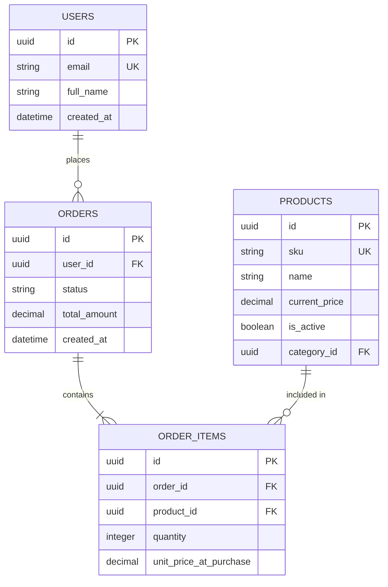

# Example Output: E-Commerce Order Schema

### 1. Resumen de Diseño
El diseño propuesto utiliza un enfoque de base de datos relacional (PostgreSQL) para garantizar la integridad transaccional (ACID) requerida en el procesamiento de órdenes. Se ha priorizado la normalización hasta 3NF para evitar anomalías en la actualización de precios e inventario.

### 2. Esquema (Tablas e Índices)
- **`users`**: Almacena información de clientes.
  - *Índices*: B-Tree en `email` (único) para login rápido.
- **`products`**: Catálogo de productos.
  - *Índices*: B-Tree compuesto en `(category_id, is_active)` para filtrado rápido.
- **`orders`**: Cabecera de órdenes de compra.
  - *Índices*: B-Tree en `user_id` para consultar el historial del cliente. B-Tree en `status` para dashboards operativos.
- **`order_items`**: Detalle de productos por orden (M:N entre orders y products).
  - *Notas*: Almacena el `unit_price_at_purchase` para inmutabilidad del historial.

### 3. Diagrama ER

### 4. Estrategia de Migración
Dado que estamos agregando la tabla `orders` a un sistema que previamente no la tenía:
1. Crear las tablas `orders` y `order_items` con sus respectivas Foreign Keys.
2. Crear los índices concurrentemente (`CREATE INDEX CONCURRENTLY` en PostgreSQL) para no bloquear lecturas.
3. Desplegar la actualización del ORM que empiece a insertar registros en estas nuevas tablas sin afectar flujos existentes.

### 5. Scorecard
- **Performance**: 8/10 (Índices optimizados para consultas principales, pendiente definir estrategia de particionado si las órdenes crecen masivamente).
- **Escalabilidad**: 7/10 (Modelo relacional clásico, escalará verticalmente de forma eficiente).
- **Data Integrity**: 10/10 (ACID garantizado, inmutabilidad de precios en el carrito a través de `unit_price_at_purchase`).
